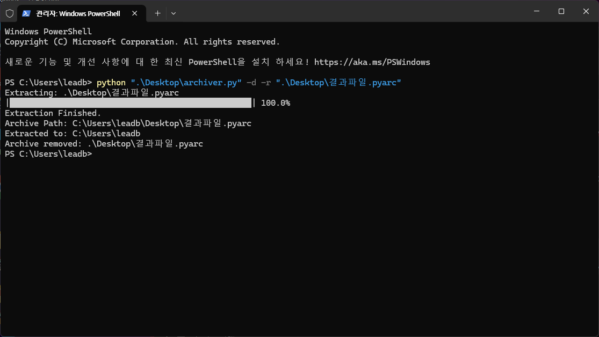

# archiver
Python-made File &amp; Folder Compressor

---

# 압축법

Win + R ==> `wt` 입력 후 엔터
<br>
```cmd
python archiver.py -c "압축 대상 폴더" "압축 후 생설될 파일의 이름"
```
<br>
실행 후 원하는 압축 단계 입력

---

# 압축 해제법

Win + R ==> wt 입력 후 엔터
<br>
```cmd
python archiver.py -d "압축 해제 대상 파일 이름.pyarc"
```

---

# 기타 옵션

`-r` 옵션: 압축/압축 해제 후 원본 파일 삭제
<br><br>
압축률 옵션: 압축 대상의 압축률 설정<br>(0~9 사이의 정수 중 선택, 숫자가 높을수록<br>메모리를 더 많이 소모하지만 압축은 잘됨)

---

# 예시 사진


<br>


---

# 주의사항

`.pdf` `.hwpx` `.mp4` 등의 무겁거나 이미 압축된 파일,<br>압축이 잘 안되는 파일, 규칙성이 없는 파일 등은 압축률이 낮음

---

[](https://opensource.org/licenses/Apache-2.0)
