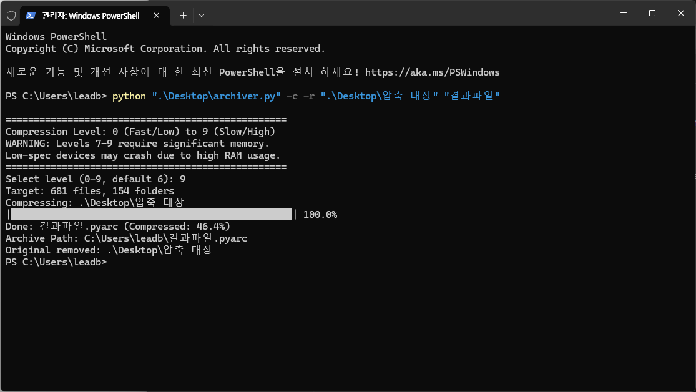

# archiver
Python-made File &amp; Folder Compressor

---

# 압축법

Win + R ==> wt 입력 후 엔터
  
`python archiver.py -c "압축 대상 폴더" "압축 후 생설될 파일의 이름"`

---

# 압축 해제법

Win + R ==> wt 입력 후 엔터
  
`python archiver.py -d "압축 해제 대상 파일 이름.pyarc"`

---

# 기타 옵션

`-r` 옵션: 압축/압축 해제 후 원본 파일 삭제

---

# 예시 사진

