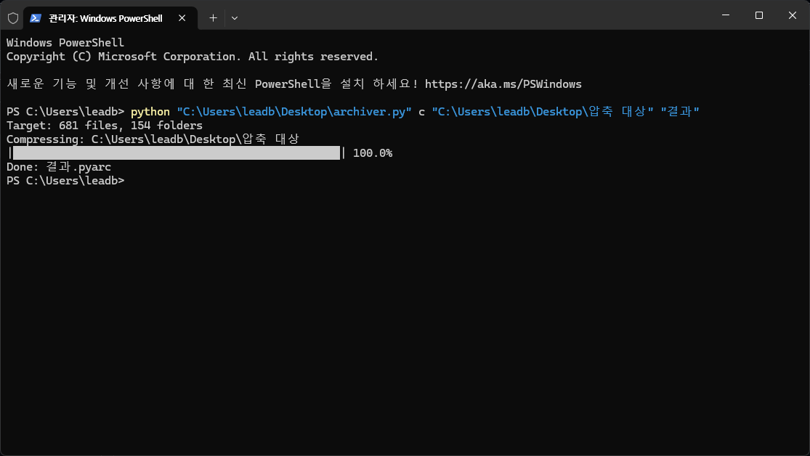

# archiver
File &amp; Folder Compressor by Python

---

# 압축법

Win + R ==> wt 입력 후 엔터
  
`python archiver.py c "압축 대상 폴더/파일 경로" "압축 후 생설될 파일의 이름"`

---

# 압축 해제법

Win + R ==> wt 입력 후 엔터
  
`python archiver.py d "압축 해제 대상 파일의 경로"`

# 예시 사진

<!--

-->

